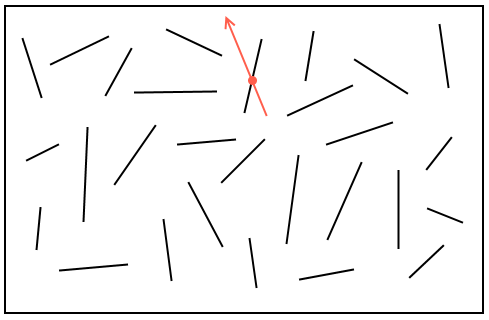

# Collision Detection

Given a segment set, there's also another segment considered to be a query, which must be used to determine which segment from the set it intersects with. Query done in an average time of `O(logN)`. It might not intersect with any segment from the set.

In the figure below, black segments represent the search space where the query is performed on, and the orange segment represents the query. In logarithmic time, the solid dot is obtained, which represents the position where a point moving from the origin to its end would collide.

