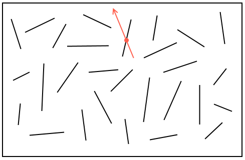

# Detección de colisiones

Dado un conjunto de segmentos, se tiene otro segmento que se considera una consulta, con la cual se debe buscar con que segmento intersecta del conjunto. Consulta hecha en orden `O(logN)` en el caso promedio. Podría no intersectar con ningún segmento también.

En la ilustración, los segmentos negros corresponden al conjunto donde se realiza la búsqueda, y el segmento naranja es la consulta. En tiempo logaritmico se obtiene el punto solido naranjo, el cual representa la posición en la que quedaría un punto que se intenta desplazar desde el origen del segmento consulta hacia el final (en sentido de la flecha).

